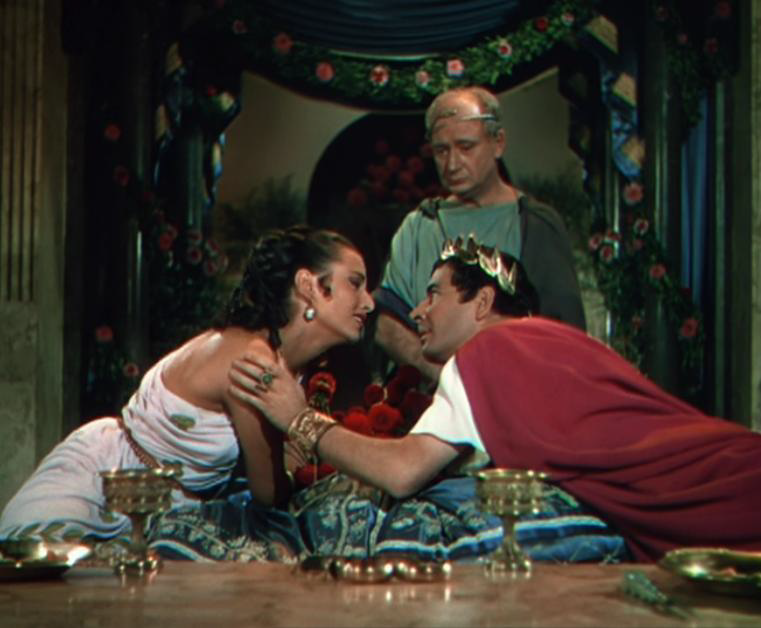

# I3D-PyTorch
This is a simple and crude implementation of Inflated 3D ConvNet Models (I3D) in PyTorch. Different from models reported in "[Quo Vadis, Action Recognition? A New Model and the Kinetics Dataset](https://arxiv.org/abs/1705.07750)" by Joao Carreira and Andrew Zisserman, this implementation uses [ResNet](https://arxiv.org/pdf/1512.03385.pdf) as backbone.

<div align="center">
  
</div>

## Enviroment Setup

```bash
conda create -n open-mmlab2 python=3.8 pytorch=1.10 cudatoolkit=11.3 torchvision -c pytorch -y
conda activate open-mmlab2
git clone https://github.com/open-mmlab/mim.git
cd mim
pip install -e .
mim install mmaction2 -f https://github.com/open-mmlab/mmaction2.git
pip install mmcv-full
```

## Data Preparation

```bash
- i3d-pytorch                #-root folder
  - data                     #-folder that holds all the data
    - rawframes              #-folder that stores the frames of the videos/gifs
      - Jump                 #-action 1 folder
        - Jump1.gif          #-action 1.1 folder
          - 1.jpg            #
        - Jump2.gif          #-action 1.2 folder
          - 1.jpg            #
      - Kick                 #-action 2 folder
        - Kick1.gif          #-action 2.1 folder
          - 1.jpg            #
        - Kick2.gif          #-action 2.2 folder
          - 1.jpg            #
    - annotations            #-folder that stores the labels of the val/train sets
      - classInd.txt         #-class labels
      - testlist.txt         #-validation videos/gifs
      - trainlist.txt        #-training videos/gifs
    - UCF-101                #-folder that stores the videos/gifs
      - Jump                 #-videos/gifs that classify action 1 folder
        - Jump1.gif          #
      - Kick                 #-videos/gifs that classify action 2 folder
        - Kick1.gif          #
```

## Training

To train a new model, use the `main.py` script.

For example, command to train models with RGB modality on UCF101 can be

```bash
python main.py ucf101 RGB <root_path> \
    <ucf101_rgb_train_list> <ucf101_rgb_val_list> \
    --arch i3d_resnet50 --clip_length 64 \
    --lr 0.001 --lr_steps 30 60 --epochs 80 \
    -b 32 -j 8 --dropout 0.8 \
    --snapshot_pref ucf101_i3d_resnet50
```

Please refer to [main.py](main.py) for more details.

## Testing

After training, there will checkpoints saved by pytorch, for example `ucf101_i3d_resnet50_rgb_model_best.pth.tar`.

Use the following command to test its performance:

```bash
python test_models.py ucf101 RGB <root_path> \
    <ucf101_rgb_val_list> ucf101_i3d_resnet50_rgb_model_best.pth.tar \
    --arch i3d_resnet50 --save_scores <score_file_name>
```

Please refer to [test_models.py](test_models.py) for more details.